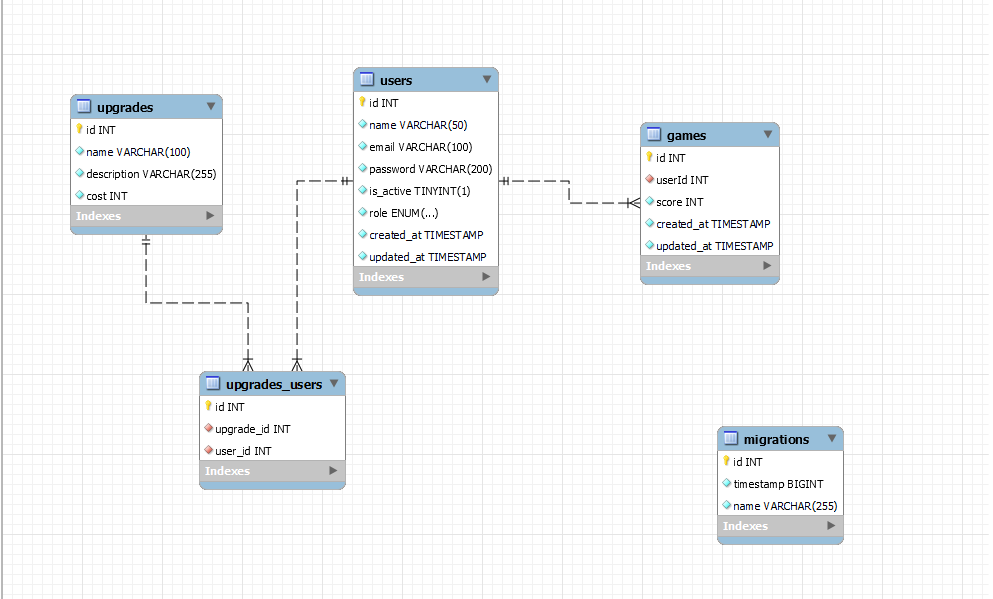

<h1 align="center">☾ - TRAIL OF BOMBS BACKEND - ☽</p></h1>

---
### ✪ [Enlace al repositorio](https://github.com/PabloProst/tob_backend)
### ✪ [Enlace a mi Linkedin](https://www.linkedin.com/in/pablo-ezequiel-prost-926ab6297/)

---

## ⚘ Desarrollo:

``` js
 const developer = "PabloProst";

 console.log("Desarrollado por: " + PabloProst);
```  
---

## &nbsp;&nbsp;&nbsp;&nbsp;&nbsp;&nbsp;&nbsp;&nbsp;&nbsp;&nbsp;&nbsp;&nbsp;&nbsp;&nbsp;&nbsp;&nbsp;&nbsp;&nbsp;&nbsp;&nbsp;&nbsp;&nbsp;&nbsp;&nbsp;&nbsp;&nbsp;&nbsp;&nbsp;&nbsp;&nbsp;&nbsp;&nbsp;&nbsp;&nbsp;&nbsp;&nbsp;:mag: OBJETIVO :mag:

#### ▫︎ Este proyecto es un backend para la aplicación de Trail of bombs ▫︎

---

## Tecnologías utilizadas:

#### ✒︎ MySQL
#### ✒︎ Typescript
#### ✒︎ Postman
#### ✒︎ Github
#### ✒︎ Node
#### ✒︎ Nodemon

---
## &nbsp;&nbsp;&nbsp;&nbsp;&nbsp;&nbsp;&nbsp;&nbsp;&nbsp;&nbsp;&nbsp;&nbsp;&nbsp;&nbsp;&nbsp;&nbsp;&nbsp;&nbsp;&nbsp;&nbsp;&nbsp;&nbsp;&nbsp;&nbsp;&nbsp;&nbsp;&nbsp;&nbsp;&nbsp;&nbsp;&nbsp;&nbsp;:rocket: DIAGRAMA BBDD :rocket:




---

## :gear: Instalación en local :gear:
1. Clonar el repositorio
2. ` $ npm install `
3. Conectamos nuestro repositorio con la base de datos 
4. ``` $ Ejecutamos las migraciones ``` 
5. ``` $ npm run dev ```  para poner el servidor en marcha

----
## ✦ Endpoints ✦

<details>
<summary>Endpoints</summary>

- **REGISTER**

    ```
    POST http://localhost:3000/register

    {
        "name": "pedro",
        "email": "pedro@pedro.com",
        "password": "1234A!"
    }
    ```

- **LOGIN**

    ```
    POST http://localhost:3000/login

    {
        "email": "pedro@pedro.com",
        "password": "1234A!"
    }
    ```

- **PROFILE**

    ```
    POST http://localhost:3000/profile

    TOKEN +

    {
        "email": "pedro@pedro.com",
        "password": "GeeksHubs1!"
    }
    ```

- **UPDATE USER**

    ```
    POST http://localhost:3000/update

    TOKEN +

    {
        "email": "hola@pedro.com",
        "password": "1111A!"
    }
    ```

- **GET ALL USERS (ADMIN)**

    ```
    POST http://localhost:3000/admin/users
    ```


</details>


---
## ✦ Licencia ✦
Este proyecto se encuentra bajo licencia de "Pablo Prost"